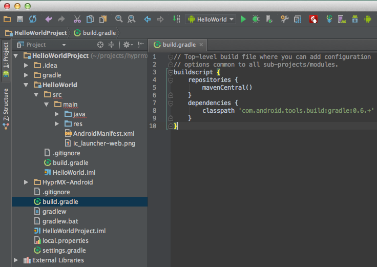

# HyprMX Android SDK

This is the main repository for the HyprMX Android SDK. 

# Structure

> **Code** - Source Code, Assets and Eclipse Project Files for SDK and Examples

> **Docs** - Documentation of SDK, Specification Documents for Project, HyprMX JSON API Documentation

# Overview

The HyprMX library, and your interaction with it, is largely structured around the HyprMXHelper singleton. The goal here is to provide an overview of how the HyprMX library will interact with your application. For detailed usage information, refer to the UsageGuide as well as the JavaDoc.

When you interact with the HyprMXHelper, it will determine what intents to fire based on the current offers available or required information needed. The intents start internal HyprMX activities that, when finished, return a result to your activity. Your activity must be setup to process the result properly (see the usage guide). The result will be processed by the HyprMXHelper again and you will be notified of completion/cancellation/errors in your activity.

The HyprMX lifecycle is fully self contained. You needn't worry about preserving state for HyprMX as HyprMX will pause and resume/recreate it's own activities and maintain it's own state. When your application is resumed (provided it wasn't killed by the user or a device restart), HyprMX will re-create it's own state and return the user to wherever they left off. This remains true even if you hide app from the recents (using android:excludeFromRecents). You will, of course, still need to maintain state in your own activities between lifecycle events.

# Prerequisites

The following prerequisites are required to utilize the HyprMX SDK.

* [JDK 6][JDK] is required. This may already be installed on your development machine.
* The Android SDK, available at the [Android SDK site][SDK].
	* When installing the SDK, you'll also need to install certain Android API versions.
	* After installing the SDK, execute 
	
	`$ <android-sdks>/tools/android update sdk`
	
	* You'll be (eventually) presented with a window that has a load of options that you can install. At a _minimum_ you'll need to install the *SDK Platform* under *Android 2.3.3 (API 10)*. You'll likely want to use the latest SDK, currently Android 4.2.2 (API 17). You'll also need to install the Android Support Library and the Android Support Repository.
	
* [Eclipse Indigo][Eclipse] or higher IDE is supported. 
	* Ensure that [JDT plugin][JDT] is installed. It is included in most Eclipse packages. 
	* Install the [Android Development Tools plugin][ADT] (recommended).

* Alternatively, [Android Studio][AndroidStudio] or [IntelliJ][IntelliJ] IDEs are supported.

For command line builds, you will additionally need one of:

* [Apache Ant 1.8][ant] or later.
* [Gradle 1.8][Gradle] or later.

[JDK]: http://www.oracle.com/technetwork/java/javase/downloads/index.html
[SDK]: http://developer.android.com/sdk/index.html
[Eclipse]: http://www.eclipse.org/downloads/
[AndroidStudio]: http://developer.android.com/sdk/installing/studio.html
[IntelliJ]: http://www.jetbrains.com/idea/features/android.html
[JDT]: http://www.eclipse.org/jdt
[ADT]: http://developer.android.com/tools/sdk/eclipse-adt.html
[ant]: http://ant.apache.org/
[AVDSetup]: http://developer.android.com/tools/devices/index.html
[AVDReference]: http://developer.android.com/tools/help/emulator.html
[Gradle]: http://gradle.org/

# Building

The following sections detail how to build the SDK and the example application. 

<a name="commandlinesetup" />
## Setting up the command line environment

* Clone this repository onto your development machine. 
* Launch a terminal and `cd` to the base of the repository.
* The easiest way to set up your environment is to execute the following command at the terminal. Note that for this command to be successful, you _must_ have the `android` executable from the Android SDK's `tools/` directory in your executable path.

`$ ant setup`
or
`$ ./gradlew setup`

* If this step fails, ensure that `android` is in your executable path and try again.

### Building for various targets

You should now have an environment capable of building the project. The following targets are available through the standard Android build.xml environment:

* `setup`   : updates local and project properties for building from the command line.
* `clean`   : simply cleans the entire environment.
* `debug`   : build the debug version of the SDK library project and the example application.
* `install` : install the example application to a USB connected device or emulator

The following targets are available through the Gradle build.gradle file:

* `setup`   : updates local and project properties for building from the command line.
* `clean`   : simply cleans the entire environment.
* `assembleDebug`   : build the debug version of the SDK library project and the example application.
* `installApp` : install the example application to a USB connected device or emulator

## Setting up the Eclipse environment

The following section details how to utilize the Eclipse IDE to develop with the HyprMX SDK.

* Launch Eclipse. If this is your first time using Eclipse, you'll be asked to create a workspace. The defaults should be just fine.
* In the Package Explorer, right-click and select `Import...` bringing up the following dialog.


* Select `General => Existing Project into Workspace`. This brings up the Import Projects dialog.
* Click the `Browse...` button and navigate to the `HyprMX-Mobile-Android-SDK/Code` directory as depicted below.


* Press the `Open` button.
* You'll be presented with the following dialog.


* Press the `Finish` button.
	* Depending on your Eclipse workspace defaults, you might receive an error in the console that says something like `[2012-08-02 11:46:28 - com.hyprmx.android.sdk.HyprMXOfferViewerActivity] Android requires compiler compliance level 5.0 or 6.0. Found '1.4' instead. Please use Android Tools > Fix Project Properties.` If faced with this, right-click on the project name in the Package Explorer, go down to Android Tools and select Fix Project Properties as described.
	* Also depending on your workspace defaults, you might receive many errors in the `Problems` tab like this `The method onClick(View) of type new View.OnClickListener(){} must override a superclass method`. If you receive this error, select the `Eclipse` => `Preferences...` menu item and navigate to `Java` => `Compiler`. For `Compiler compliance level` select `1.6` from the dropdown menu, then press the `Okay` button. 
	* Any transient compiler errors following these steps can likely be cleared up by selecting `Project` => `Clean...` and selecting the `Clean all projects` radio button, then clicking okay.
	
* You _should_ now have a working Eclipse environment.

## Setting up the Android Studio/IntelliJ IDEA environment

The following section details how to use the HyprMX SDK. This guide assumes you already have your gradle-based project up and running in Android Studio/IDEA.

* Launch Android Studio/IntelliJ IDEA. Open your existing Android application.
* Add the HyprMX-Android code to your app, either as a submodule or by copying it in.
* You should now see the HyprMX-Android folder in IDEA.
* Find the path from the root of your project to the HyprMX SDK project and add it to the `settings.gradle` in the root of your project
    * For example, with the project structure shown below:  
    `include ':HyprMX-Android:Code:HyprMX-SDK'`


* Add the path from above as a compile dependency to your app's `build.gradle` file:  
`compile project(':HyprMX-Android:Code:HyprMX-SDK')`


* Add the following code to your top-level `build.gradle`  

```
buildscript {
    repositories {
        mavenCentral()
    }
    dependencies {
        classpath 'com.android.tools.build:gradle:0.9.+'
    }
}
```



* HyprMX is now set up as a dependency of your project and is ready for you to start using it.
* Android Studio/IDEA does not support manifest merging, so you will need to follow the [Android Manifest](#androidmanifest) instructions below.

# Installing the example application

## Install goals

* The `HyprMX SDK` is an Android library project that your application project will depend on. It has a number of internal jar dependencies, but generally your project needs only to add the SDK library project as a dependency.

## Installing the Example App from the command line

* Open a terminal and cd to the base of your cloned git repository.

`$ cd HyprMX-Mobile-Android-SDK`

* Execute the following `ant` or `gradle` build command.

`$ ant install` or `$ ./gradlew installApp`

## Running in Eclipse

Running the example application from Eclipse requires an emulator ('Window => Android Virtual Device Manager') or USB connected Android device.

* Right-click on the `HyprMX Example` project in the Package Explorer. Select `Run As => Android Application`.
* If you have an emulator instance running or a physical device plugged in via USB, the example application will be installed and executed.


If you need help setting up an emulator, the Android developer docs provides [setup][AVDSetup] and [reference][AVDReference] documentation. 

## Running in Android Studio/IntelliJ IDEA

* Install Android Studio v0.3.1 or higher
* Choose *Import Project* and select the `build.gradle` file in the root of the project
* Choose the recommended *Use default gradle wrapper* import option
* Open the Gradle tasks view
* Double-click the `installApp` gradle task to execute it

# Creating a New Application With Eclipse

After creating a new Android Application Project:

* Right click on your project, select `Properties => Android`. Under the Library section click 'Add' and select the HyprMX SDK. Click 'OK'.


* If you get an error message saying something like 'Found 2 versions of android-support-v4.jar in the dependency list', just
  copy the android-support-v4.jar file located in your project's lib folder and paste it in the libs folder of the HyprMX SDK library project.
* Open the project.properties file located in the base of your project and add `manifestmerger.enabled=true`
* In the event manifest merging fails (which can happen for a variety of reasons), see the [Android Manifest](#androidmanifest) section.
* See the UsageGuide for details on how to initialize the HyprMXHelper and show various offer types.

## AndroidManifest

### General

We recomend a few general settings for your manifests. First is turning on the android:largeHeap setting for your application. HyprMX uses a web view and (potentially) large images. A larger VM Heap size will help alleviate potential issues. We also recommend turning on android:hardwareAccelerated for the same reasons.

    <application 
        android:largeHeap="true"
        android:hardwareAccelerated="true">
        ...
    </application>

### Permissions

Your application will need these manifest permissions in order for the SDK to function properly

    <uses-permission android:name="android.permission.ACCESS_NETWORK_STATE" />
    <uses-permission android:name="android.permission.WRITE_EXTERNAL_STORAGE" />
    <uses-permission android:name="android.permission.INTERNET" />

To enable location services within the SDK, additionally enable one of the location permissions like so:

    <uses-permission android:name="android.permission.ACCESS_COARSE_LOCATION" />

### Activities and Services

Ideally, you will be able to merge manifests automatically using the manifestmerger. If this fails, you can turn off merging and add the HyprMX Manifest requirements directly to your application manifest.

If you are not using a merged manifest, open the AndroidManifest.xml located in the SDK and copy all the activities and services from the `<application>` block into your own `<application>` block in the AndroidManifest.xml for your application. Be sure to update this when you update the HyprMX SDK. For this reason, we recomend using Manifest Merging if possible.

## Proguard

If your app uses proguard, then be sure to add the following lines to your `proguard-project.txt` file:

```
-keepattributes InnerClasses
-keep class com.hyprmx.** {*;}
```
